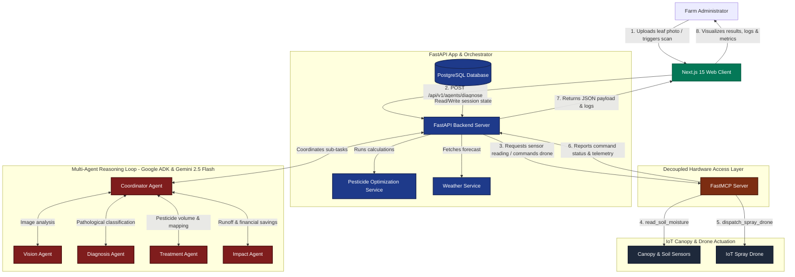
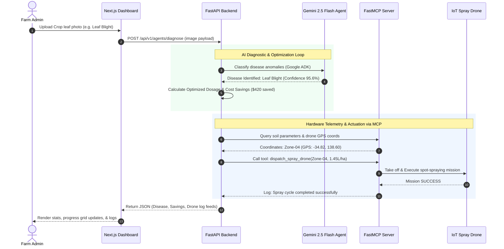

# EcoGuard AI - Project Architecture 🏛️

EcoGuard AI is a Multi-Agent Precision Agriculture platform designed to reduce pesticide volume and protect crops using coordinate-specific drone orchestration. 

This document outlines the system modules and how components interact.

---

## ⚙️ High-Level System Architecture

---

## 🔄 Multi-Agent System Data Flow

The platform relies on a decoupled multi-agent loop coordinates real-time visual assessment, spatial telemetry analysis, and target drone sprays:

---

## 📂 Core Repository Modules

Instead of monolithic models, EcoGuard AI splits presentation, orchestration, domain calculation, and device tools into clean layers:

### 1. Frontend Web Client (`/frontend`)
Powered by Next.js 15, styled with vanilla Tailwind CSS and shadcn/ui.
* **`/app/dashboard/`**: File-system routes mapping directly to Dashboard pages:
  - `page.tsx`: General statistics, and active zone status lists.
  - `upload/`: Visual capture area with simulator triggers and log monitors.
  - `analytics/`: Main Recharts visualization suite (distribution, comparisons, and timelines).
  - `settings/`: Host configuration controls.
* **`/components/`**: Divided into layout components (Sidebar, Navbar) and interactive charts (HealthPieChart, SprayComparisonChart, HealthGauge, TreatmentTimeline, and the 10x10 SprayGrid).

### 2. Backend Orchestration Server (`/backend`)
Powered by FastAPI, SQLAlchemy, and Google ADK.
* **`app/routers/`**: Standard REST controllers:
  - `agents.py`: Dispatches images to Gemini visual reasoning models.
  - `farms.py`: Core CRUD endpoint operations for fields and crops.
  - `telemetry.py`: Ingestion endpoints for IoT sensors.
* **`app/agents/`**: Core multi-agent logic scripts powered by Gemini 2.5 Flash:
  - `crop_agent.py`: Identifies crop disease types.
  - `spray_agent.py`: Computes spatial target schedules.
* **`app/services/`**: Core mathematical calculations:
  - `pesticide.py`: Spot-spraying formula constraints.
  - `weather.py`: Local coordinates forecasting via Open-Meteo.
* **`app/database/`**: Configures PostgreSQL schema entities (`models.py`) and connection sessions (`session.py`, `connection.py`).

### 3. Model Context Protocol Server (`/backend/mcp_server`)
* Exposes domain-specific APIs (soil telemetry retrieval, real-time drone battery levels, drone navigation triggers) as standard MCP tools.
* Operates as a FastMCP instance (`server.py`), decoupling core LLM logic from hardware driver libraries.
