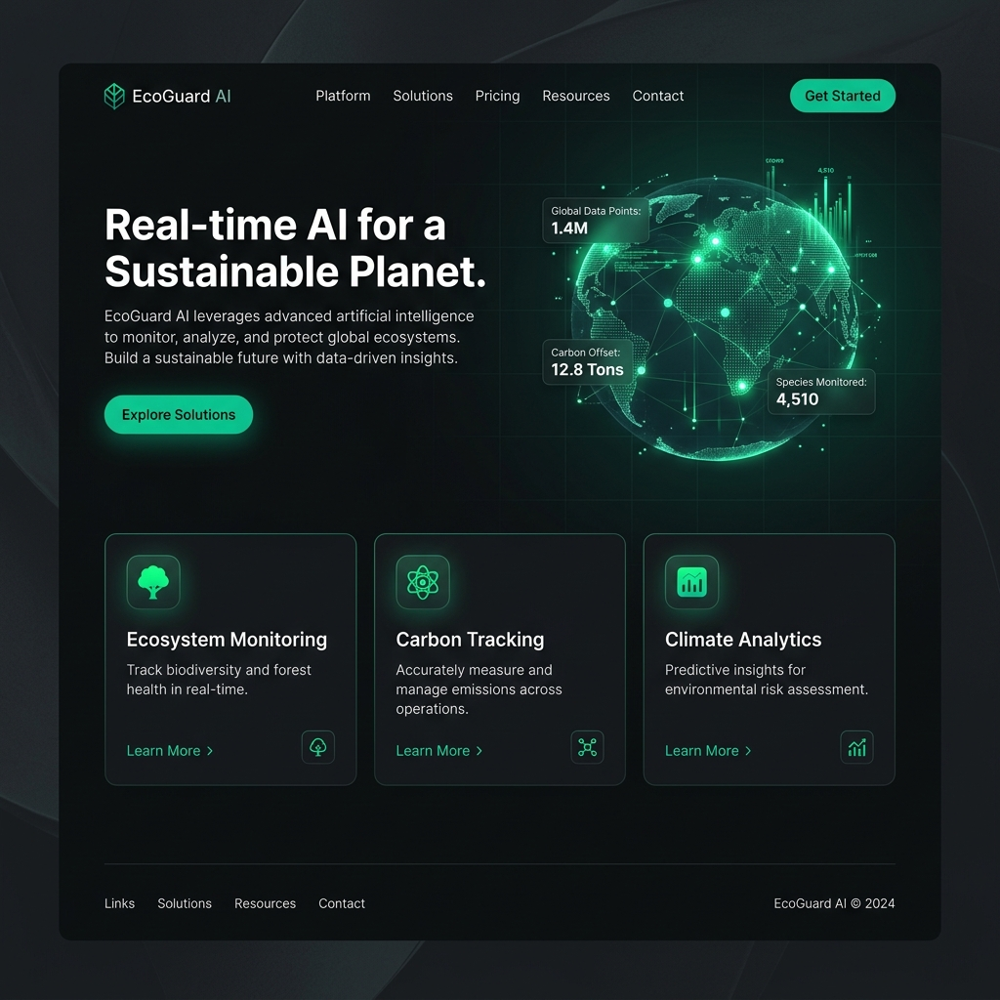
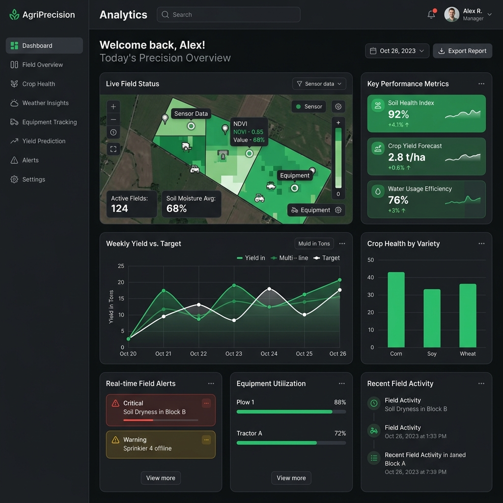
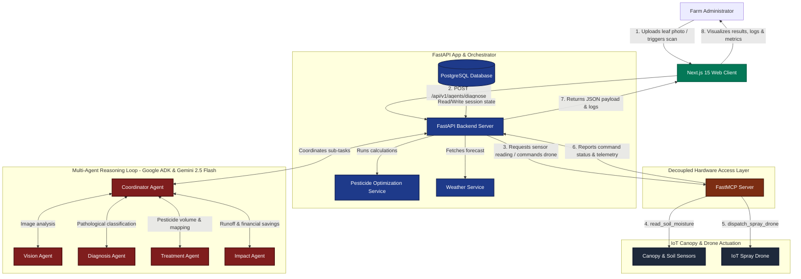

# EcoGuard AI 🌿

> **Precision Agriculture Multi-Agent System** — Reducing chemical usage and crop losses through AI-guided targeted spot spraying and drone orchestration.

[](https://vercel.com)
[](https://nextjs.org)
[](https://fastapi.tiangolo.com)
[](https://ai.google.dev)
[](https://opensource.org/licenses/MIT)

---

## 📸 Interface Preview

### Modern SaaS Landing Page
Premium dark-mode design built with Tailwind CSS and shadcn/ui.


### Real-Time Diagnostics Dashboard
Collapsible navigation sidebar, live telemetry panels, and interactive Recharts data charts.


---

## 🚨 The Problem

* **Over-spraying Crisis**: Traditional farming relies on blanket chemical applications, spraying healthy and diseased areas equally.
* **Environmental Degradation**: Excess chemical run-off damages soil ecosystems and contaminates local groundwater.
* **Financial Waste**: Excessive chemical purchases account for up to **35% of operational budgets** for medium-scale farms.
* **Crop Vulnerability**: Slow manual observation leads to delayed pest detection, resulting in massive crop losses.

---

## 💡 The Solution

EcoGuard AI changes the paradigm from **blanket spraying** to **targeted spot-spraying**. Instead of treating an entire field, our autonomous multi-agent system uses localized telemetry and visual classification to target only infected areas, minimizing chemical volumes and maximizing effectiveness.

---

## 🤖 Why a Multi-Agent System?

A single monolithic AI model cannot simultaneously parse real-time sensor streams, execute spatial pathfinding, run high-resolution visual disease classifications, and handle drone hardware dispatch. 

EcoGuard AI divides these complex responsibilities into specialized agents using the **Google ADK & Gemini 2.5 Flash**:

* 👤 **Coordinator Agent**: Orchestrates data pipelines, assigns sub-tasks to other agents, and handles external APIs.
* 👁️ **Vision Agent**: Evaluates visual inputs (images and video feeds) from drones or static field cameras.
* 🩺 **Diagnosis Agent**: Determines exact crop diseases (e.g. *Leaf Blight*), assesses infestation severity, and evaluates confidence intervals.
* 🚁 **Treatment Agent**: Interfaces with spatial grids, generates spot-spraying plans, and calculates optimal dosage volumes.
* 📈 **Impact Agent**: Processes metrics to calculate chemical reduction volumes and cost savings ($).

---

## ⚙️ High-Level System Architecture



### Core Architecture Layers:
* **Frontend**: Next.js 15 app router, styled using vanilla Tailwind CSS and shadcn/ui. Handles stats display, custom chart analytics, and the interactive spray grid simulator.
* **Backend**: FastAPI web framework handling database sessions, telemetry API routes, and calculations.
* **Agents (ADK)**: Autonomous logic units powered by Gemini 2.5 Flash for image recognition, diagnosis, and action plan generation.
* **MCP Tools**: Standalone FastMCP server bridging the AI agents with local hardware tools (canopy cameras, soil sensors, drone flight boards).

---

## 🔌 Model Context Protocol (MCP) Integration

The **Model Context Protocol (MCP)** acts as a clean, standardized abstraction layer between LLMs and real-world hardware. 

Instead of hardcoding APIs inside agent prompts, the FastMCP server exposes local tools:
* `read_soil_moisture()`: Reads telemetry from physical IoT sensors.
* `dispatch_spray_drone(coordinates, dosage)`: Teleports and dispatches target-specific drone treatments.

This makes our AI agents **fully decoupled from hardware implementation details**, allowing them to run tool-calls dynamically based on local conditions.

---

## ✨ Features

* **Visual Ingestion**: Drag-and-drop crop photography uploader with live preview rendering.
* **Precision Simulator**: A dedicated **Run Demo** action simulating crop leaf scanning, generating precise diagnostic outputs.
* **Interactive 10x10 Spray Grid**: Real-time grid dashboard allowing users to toggle healthy/diseased fields, trigger precision spraying, and watch environmental savings adapt dynamically.
* **Recharts Dashboard**: Grouped bar charts (Traditional vs. EcoGuard volume comparisons), radial gauges (overall health index), and area curves (soil moisture trends).
* **API Configuration Hub**: Configurator for Google Gemini keys, local database pools, and critical moisture alert limits.

---

## 📈 Impact Metrics

Our precision models yield measurable environmental and financial savings:
* 📉 **-81% Chemical Reduction**: Spot spraying reduces pesticide usage by over 80% compared to blanket scheduling.
* 💰 **$420 Savings Per Hectare**: Immediate savings on crop chemical purchases.
* 🌱 **87/100 Environmental Index**: Improved soil microbiome preservation, beneficial insect survival, and minimal groundwater contamination.

---

## 🚜 Demo Walkthrough

1. Navigate to **Upload** in the dashboard.
2. Select an image or click **Run Demo** to load the leaf scan.
3. Observe the progress bar as the **Vision & Diagnosis Agents** process the image.
4. Review the results panel:
   * **Diagnosis**: *Leaf Blight* (Confidence: 95.6%, Severity: Medium)
   - **Savings**: *81% Chemical Saving* and *$420 Money Saving*.
5. View the **Agent Execution Logs** to see FastMCP tool dispatch logs.
6. Check **Analytics** to view updated charts and interact with the **10x10 Spray Grid**.

---

## 🛠️ Tech Stack

* **Frontend**: Next.js 15 (React 19), TypeScript, Tailwind CSS, shadcn/ui, Recharts
* **Backend**: FastAPI (Python 3.11), SQLAlchemy, PostgreSQL
* **AI/Orchestration**: Google GenAI SDK (ADK), Gemini 2.5 Flash
* **Hardware Integration**: FastMCP Server

---

## 🚀 How to Run Locally

### 1. Run the Frontend (Next.js)
```bash
cd frontend
npm install
npm run dev
```
*Client runs at [http://localhost:3000](http://localhost:3000).*

### 2. Run the Backend (FastAPI)
```bash
cd backend
python -m venv venv
# Windows:
.\venv\Scripts\Activate.ps1
# macOS/Linux:
source venv/bin/activate
pip install -r requirements.txt
python -m uvicorn app.main:app --reload --port 8000
```
*API documentation at [http://localhost:8000/docs](http://localhost:8000/docs).*

### 3. Run the MCP Server
```bash
# Ensure your virtual environment is active in the backend folder
python -m uvicorn mcp_server.server:app --reload --port 8001
```

---

Built for Agents for Good Hackathon 🌍
